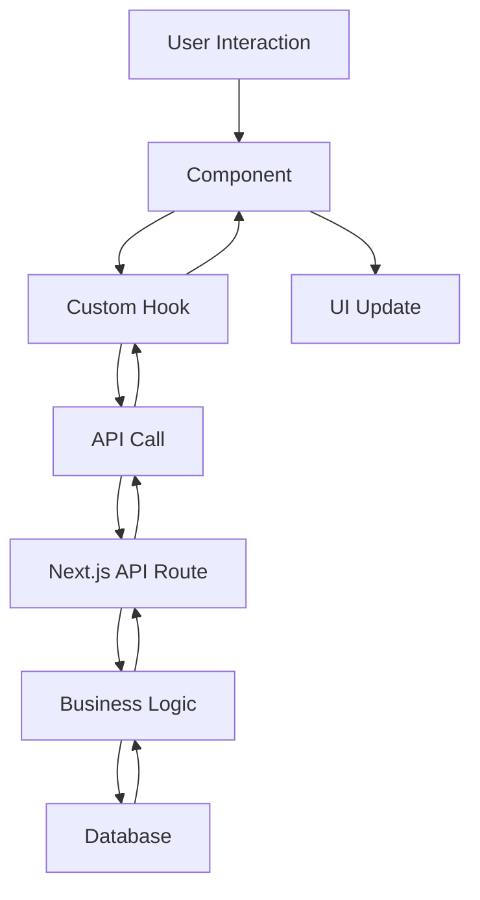

# Architecture Overview

FleetFlow is built using modern web technologies with a focus on performance, scalability, and maintainability.

## High-Level Architecture

```
┌─────────────────┐    ┌─────────────────┐    ┌─────────────────┐
│   Frontend      │    │   API Layer     │    │   Database      │
│   (Next.js)     │◄──►│   (Next.js API) │◄──►│   (PostgreSQL)  │
└─────────────────┘    └─────────────────┘    └─────────────────┘
          │                       │                       │
          ▼                       ▼                       ▼
┌─────────────────┐    ┌─────────────────┐    ┌─────────────────┐
│   UI Components │    │   Services      │    │   Data Models   │
│   (Radix UI)    │    │   (Business     │    │   (Prisma)      │
└─────────────────┘    │    Logic)       │    └─────────────────┘
                       └─────────────────┘
```

## Frontend Architecture

### Component Structure

```
components/
├── ui/                 # Base UI components (buttons, cards, etc.)
├── layout/            # Layout components (sidebar, header, etc.)
├── features/          # Feature-specific components
│   ├── fleet/         # Fleet management components
│   ├── tracking/      # Package tracking components
│   ├── dashboard/     # Dashboard components
│   └── auth/          # Authentication components
└── shared/            # Shared utility components
```

### Design Patterns

1. **Component Composition**: Using compound components for complex UI elements
2. **Custom Hooks**: Extracting reusable logic into custom hooks
3. **Context API**: Managing global state with React Context
4. **Form Handling**: Using React Hook Form with Zod validation

### State Management

- **Local State**: React's useState and useReducer
- **Form State**: React Hook Form
- **Theme State**: Next Themes
- **Server State**: SWR/React Query (future implementation)

## Styling Architecture

### Design System

```
styles/
├── globals.css        # Global styles and CSS variables
├── components.css     # Component-specific styles
└── utilities.css      # Utility classes
```

### Theme System

- **CSS Variables**: Dynamic theme switching
- **Tailwind Classes**: Utility-first styling approach
- **Component Variants**: Class Variance Authority for component variants

### Color Palette

```css
/* Light Theme */
--background: 0 0% 100%;
--foreground: 222.2 84% 4.9%;
--accent: 262.1 83.3% 57.8%;

/* Dark Theme */
--background: 222.2 84% 4.9%;
--foreground: 210 40% 98%;
--accent: 262.1 83.3% 57.8%;
```

## Performance Optimizations

### Next.js Features

1. **App Router**: Leveraging the new App Router for better performance
2. **Server Components**: Using RSC for faster initial page loads
3. **Image Optimization**: Next.js Image component for optimized images
4. **Font Optimization**: Local font loading with Geist fonts

### Code Splitting

- **Route-based splitting**: Automatic code splitting per route
- **Component lazy loading**: Dynamic imports for heavy components
- **Bundle analysis**: Webpack bundle analyzer for optimization

### Caching Strategy

- **Static Generation**: Pre-generated pages for public content
- **ISR**: Incremental Static Regeneration for dynamic content
- **Client-side caching**: SWR for API response caching

## Security Considerations

### Authentication & Authorization

- **JWT Tokens**: Secure token-based authentication
- **Role-based Access**: Different user roles and permissions
- **Session Management**: Secure session handling

### Data Validation

- **Input Validation**: Zod schemas for type-safe validation
- **Sanitization**: XSS protection with proper sanitization
- **CSRF Protection**: Built-in Next.js CSRF protection

## Scalability

### Code Organization

- **Modular Architecture**: Feature-based folder structure
- **Reusable Components**: Shared component library
- **TypeScript**: Type safety for better maintainability

### Performance Monitoring

- **Vercel Analytics**: Performance monitoring and insights
- **Error Tracking**: Error boundary implementation
- **Lighthouse Scores**: Regular performance audits

## Data Flow



## Future Enhancements

### Planned Improvements

1. **Real-time Updates**: WebSocket integration for live data
2. **Mobile App**: React Native application
3. **Microservices**: Breaking down into smaller services
4. **GraphQL**: API layer improvement with GraphQL

### Technical Debt

- [ ] Add comprehensive test coverage
- [ ] Implement proper error boundaries
- [ ] Add internationalization (i18n)
- [ ] Optimize bundle size further
